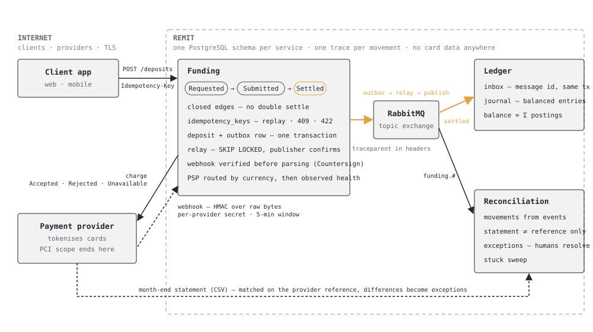

# Remit

[](https://github.com/value-al/Remit/actions/workflows/ci.yml)
[](LICENSE)

A reference money-movement backend for a retail trading or fintech platform, in .NET 10 —
deposits and withdrawals through payment providers, a double-entry ledger, reconciliation,
and the messaging and observability that hold it together.

It is small on purpose. The point is not the code volume; it is that every decision a system
like this has to make is **made, written down, and shown running**.

> The domain is generic. Nothing here describes any particular company's system.

<picture>
  <source media="(prefers-color-scheme: dark)" srcset="docs/architecture/remit-overview-dark.svg">
  
</picture>

*One deposit, end to end. Orange is the money-carrying event; dashed lines cross a trust boundary.*

<picture>
  <source media="(prefers-color-scheme: dark)" srcset="docs/architecture/remit-overview-dark.svg">
  
</picture>

*One deposit, end to end. Orange is the money-carrying event; dashed lines cross a trust boundary.*

## What is decided

| Decision | Where |
|---|---|
| Scope and non-goals — no card data, no FX, one region | [ADR-0001](docs/adr/0001-scope-and-non-goals.md) |
| `Idempotency-Key` at the edge, state machines at the core | [ADR-0002](docs/adr/0002-idempotency-keys-and-state-machines.md) |
| Outbox in every service, never a dual write | [ADR-0003](docs/adr/0003-outbox-over-dual-write.md) |
| Double-entry ledger, balanced by construction | [ADR-0004](docs/adr/0004-double-entry-ledger.md) |
| PostgreSQL per service, EF Core migrations, polling relay with SKIP LOCKED, xmin concurrency | [ADR-0005](docs/adr/0005-persistence-and-relay.md) |
| One PSP boundary with three outcomes; route by currency then health; submit sync, settle by signed webhook | [ADR-0006](docs/adr/0006-psp-boundary-and-webhooks.md) |
| Ledger consumes with an inbox (exactly-once posting); withdrawals mirror deposits; one trace per money movement | [ADR-0007](docs/adr/0007-ledger-consumer-withdrawals-telemetry.md) |
| AKS by Bicep; workload identity + Key Vault CSI instead of credentials; migrations as pre-upgrade Jobs; locked-down pods | [ADR-0008](docs/adr/0008-aks-workload-identity-key-vault.md) |
| Reconciliation keeps its own record, matches statements on the reference only, raises five kinds of exception and never fixes anything | [ADR-0009](docs/adr/0009-reconciliation.md) |
| Context and container diagrams, PCI scope boundary | [C4](docs/architecture/c4-context.md) |
| Five SLOs measured from telemetry that already exists, alerts, error-budget policy | [SLOs](docs/operations/slo.md) |
| STRIDE threat model of the deposit flow — controls in place, residuals, the five fixes to do first | [Threat model](docs/security/threat-model-deposit-flow.md) |

## What runs today

- `Remit.BuildingBlocks` — `Money`, the idempotency middleware and store contract, the outbox
  contract, the unit of work.
- `Remit.Funding` — `POST /deposits` (idempotent, 202, deposit + outbox row in one transaction)
  and `GET /deposits/{id}`; `Deposit` as an explicit state machine with its transitions
  persisted; **PostgreSQL** via EF Core with checked-in migrations, one schema per service;
  idempotency keys in a table whose primary key is the claim; an **outbox relay** hosted
  service that drains `funding.outbox` with `FOR UPDATE SKIP LOCKED` and publishes to a
  **RabbitMQ** topic exchange with publisher confirms.
- **PSP boundary** — `IPaymentProvider` with exactly three outcomes (accepted / rejected /
  unavailable); `PspRouter` filters by currency, ranks by a sliding-window success rate, demotes
  degraded providers, and falls through outages; two simulated providers from configuration.
  `POST /deposits` submits synchronously and returns the provider and reference.
- **Signed webhooks** at `POST /webhooks/psp/{provider}`, verified with
  [Countersign](https://github.com/value-al/Countersign) over the raw bytes — per-provider webhook
  secret, `timestamp.body` canonical form, five-minute replay window — before anything is parsed.
  Duplicates and strays are acknowledged with `applied: false`, never applied twice.
- **Withdrawals** — `POST /withdrawals` mirrors deposits: advisory balance check against the
  ledger (422 when short), same state machine, same router (`PayoutAsync`), same signed webhook
  with `withdrawalId`.
- `Remit.Ledger` — a service now. Consumes `funding.deposit.settled.v1` and
  `funding.withdrawal.paid.v1` from RabbitMQ through the shared `RabbitMqConsumer` (durable
  queue, manual acks, dead-letter after two failures) and posts journal entries **exactly once**
  via an inbox row written in the same transaction. `GET /accounts/{id}/balance?currency=EUR`
  derives the balance from the journal every time; `GET /entries?correlationId=` shows the
  postings behind any movement.
- **OpenTelemetry** in both services: ASP.NET Core, HttpClient, Npgsql and every `Remit.*` span;
  W3C trace context carried in RabbitMQ headers, so one trace runs request → relay → publish →
  consume → postings. OTLP export to the compose file's Jaeger when `Otel:Endpoint` is set.
- `Remit.Reconciliation` — consumes every Funding event into its own `movements` table (inbox,
  out-of-order safe). `POST /statements/{provider}?from&to` takes the provider's CSV, matches on
  the PSP reference and raises `UnknownAtPsp`, `AmountMismatch`, `SettledButNotFinal` (a lost
  webhook) and `MissingAtPsp` — once per reference, however often the statement is re-posted.
  A sweep raises `Stuck` for anything left in `Requested`/`SubmittedToPsp` too long — the gap
  ADR-0006 left open. `GET /exceptions`, `POST /exceptions/{id}/resolve` with a written reason,
  once. It never posts, never replays, never marks anything settled.
- **Deployment** — `infra/bicep/main.bicep` (Log Analytics, ACR, Key Vault in RBAC mode, PostgreSQL
  Flexible Server, AKS with OIDC issuer + workload identity + Key Vault CSI add-on, one
  user-assigned identity federated to the `remit-workload` service account); `deploy/helm/remit`
  (two Deployments, migrate Jobs as pre-upgrade hooks running the image with `--migrate`,
  SecretProviderClass, in-cluster RabbitMQ and Jaeger); Dockerfiles (alpine, non-root, healthcheck);
  `/health/live` and `/health/ready`; `deploy.yml` with OIDC login. No credential anywhere in the
  repository. See [deploy/README.md](deploy/README.md).
- Tests: the idempotency contract through the HTTP pipeline in memory; and with Testcontainers,
  real PostgreSQL + RabbitMQ — deposit and outbox row written together, message delivered and
  row marked sent, replay across a database round trip, eight concurrent claims on one key
  admitting exactly one deposit. Router tests for every routing rule; webhook tests that sign
  with Countersign's `RequestSigner` and are verified by its `WebhookVerifier` — forged key,
  stale timestamp, duplicate, wrong provider, failure with reason. Ledger tests on real PostgreSQL:
  same message twice posts once, six concurrent deliveries post once, balances per currency. And
  one **end-to-end** test hosting Funding and Ledger on the same containers: deposit → signed
  webhook → relay → broker → consumer → wallet balance. Reconciliation: the matcher's rules as pure
  unit tests, and on real PostgreSQL — out-of-order events, a statement raising each exception kind
  exactly once across two uploads, resolution with a reason and only once, the stuck sweep.

Without a connection string the service runs entirely in memory. With one, it runs on
PostgreSQL; with a `RabbitMq` section as well, the relay publishes.

```sh
dotnet test                 # needs Docker for the PostgreSQL/RabbitMQ tests
bicep build infra/bicep/main.bicep && helm lint deploy/helm/remit   # infrastructure validates without a subscription
docker build -f src/Services/Remit.Funding/Dockerfile -t remit/funding .
docker compose up -d        # PostgreSQL, RabbitMQ, Redis, Jaeger
dotnet run --project src/Services/Remit.Funding   # :5000 — migrates, relays to RabbitMQ
dotnet run --project src/Services/Remit.Ledger    # :5100 — migrates, consumes, serves balances
dotnet run --project src/Services/Remit.Reconciliation   # :5200 — consumes, takes statements, lists exceptions
# Then open http://localhost:5000/console — a browser tool that drives the whole flow: deposits,
# replays, webhooks signed in the tab, balances, withdrawals, statements, exceptions.
# No local setup at all: https://value.al/tools/remit-console.html drives the public sandbox
# (deploy/sandbox — shared, rate-limited, wiped nightly).
# Traces: http://localhost:16686 (Jaeger) — search service "funding" or "ledger"
```

```sh
curl -X POST localhost:5000/deposits/ \
  -H 'Content-Type: application/json' \
  -H 'Idempotency-Key: 5f1c9a0e-1d3b-4a8c-9a7e-2c1f0b6d8e44' \
  -d '{"accountId":"11111111-1111-1111-1111-111111111111","amount":100,"currency":"EUR"}'
# → 202 Accepted, status SubmittedToPsp, provider alpha. Send it again: same response, plus
#   Idempotent-Replayed: true

# The provider settles it later with a signed webhook. Signing the exact bytes with the
# provider's webhook secret (alpha: whsec_alpha_dev), Stripe-style {timestamp}.{body}:
BODY='{"eventId":"evt_1","depositId":"<id>","reference":"<reference>","status":"settled"}'
TS=$(date +%s)
SIG=$(printf '%s.%s' "$TS" "$BODY" | openssl dgst -sha256 -hmac whsec_alpha_dev | cut -d' ' -f2)
curl -X POST localhost:5000/webhooks/psp/alpha -H 'Content-Type: application/json' \
  -H "X-Timestamp: $TS" -H "X-Signature: $SIG" -d "$BODY"
# → {"applied":true,"status":"Settled"}. Send it again → {"applied":false,"reason":"already-final"}

# A moment later the ledger has posted it:
curl "localhost:5100/accounts/11111111-1111-1111-1111-111111111111/balance?currency=EUR"
# → {"accountId":"1111…","currency":"EUR","balance":100,"postings":1}

# Month end: the provider's statement. Reconciliation matches it against what Funding told it.
printf 'reference,kind,amount,currency,settled_at\n%s,deposit,100,EUR,%s\n' "<reference>" "$(date -u +%FT%TZ)" \
  | curl -X POST "localhost:5200/statements/alpha?from=2026-08-01&to=2026-09-01" -H 'Content-Type: text/csv' --data-binary @-
# → {"lines":1,"matched":1,"exceptions":0,"raised":[]}. Change the amount to 90 → an AmountMismatch exception.
```

## Roadmap

| Week | Lands |
|---|---|
| 4 | ~~PostgreSQL persistence, outbox table and relay to RabbitMQ~~ — done |
| 5 | ~~PSP adapter boundary, two simulated providers, routing by currency and success rate; webhooks verified with Countersign~~ — done |
| 6 | ~~Ledger consumer posts settlements; withdrawals; OpenTelemetry end to end~~ — done |
| 7 | ~~AKS deployment with infrastructure as code; Key Vault; managed identity~~ — done |
| 8 | ~~Reconciliation against a statement file; exceptions endpoint~~ — done |
| 9 | ~~SLO document; STRIDE threat model of the deposit flow~~ — done |

The roadmap is complete. What the threat model and ADRs leave on the table, in the order they
should be picked up: per-service database roles with an append-only ledger, NetworkPolicy,
operator identity on reconciliation, retention for traces and idempotency keys, one identity per
service, a reservation entry for withdrawals (ADR-0007), balance-level reconciliation against
`psp:receivable` (ADR-0009).

## Layout

```
src/BuildingBlocks/Remit.BuildingBlocks   Money, idempotency, outbox, messaging, telemetry
src/Services/Remit.Funding                deposits & withdrawals (HTTP)
src/Services/Remit.Ledger                 journal, consumer, balances (HTTP)
src/Services/Remit.Reconciliation         movements from events, statements, exceptions, stuck sweep
tests/                                    one test project per service
docs/adr/                                 architecture decision records
docs/architecture/                        C4 diagrams
docs/operations/                          SLOs, alerting, error-budget policy
docs/security/                            threat model
infra/bicep/                              Azure resources, one file
deploy/helm/remit/                        the chart; deploy/README.md walks the release
```

## Author

Designed and written by [Aldiger Mehilli](https://aldiger.com) — software architect for
payment and trading backends — at [value.al](https://value.al). MIT licensed.
