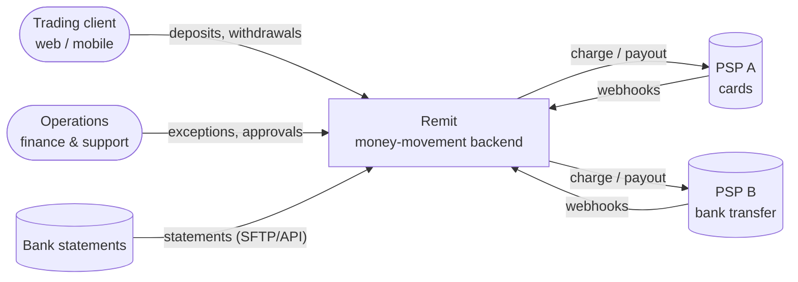
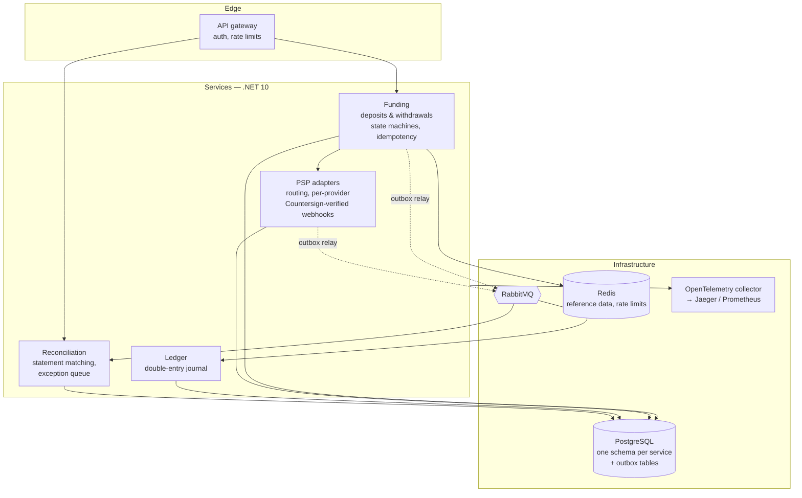

# C4 — Level 1 (context) and Level 2 (containers)

Drawn with Mermaid so it renders on GitHub and changes in pull requests.

## Context

## Containers

**PCI scope.** No container in this diagram handles card data; PSP adapters exchange
tokens and references only. The scope boundary is therefore the PSP's hosted page or
SDK, outside Remit. That is a design decision, not an accident — see ADR-0001.

Level 3 (components) is drawn per service as each one lands.
